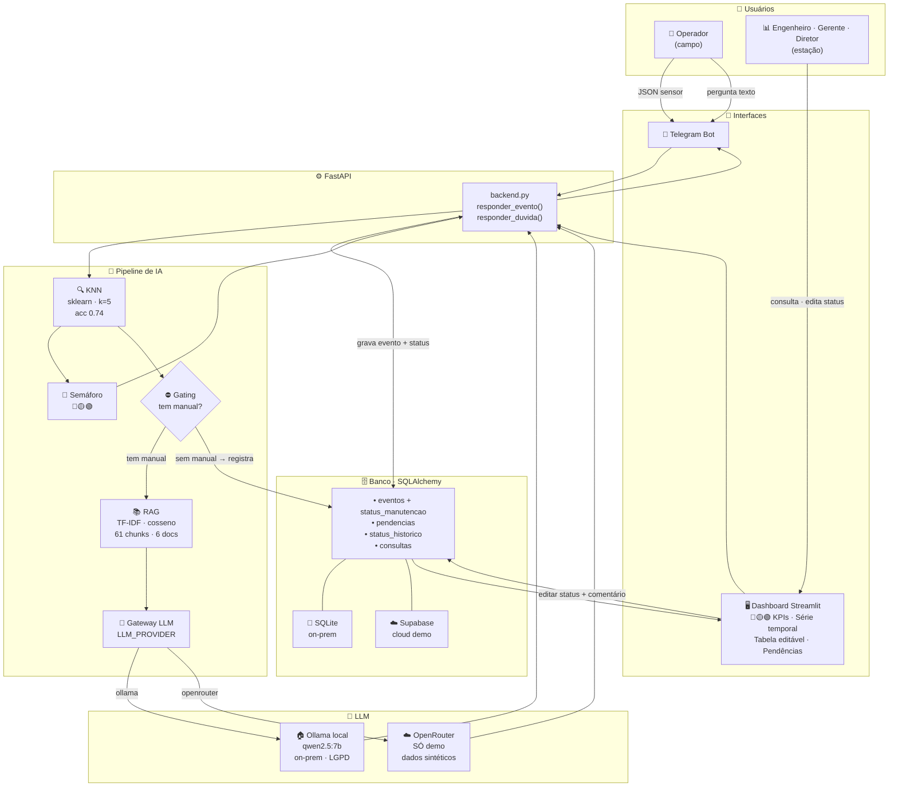

# Manutenção Prescritiva — Case SENAI/FIESC

Sistema de **manutenção prescritiva** para máquinas rotativas com sensores de vibração.
Dado um novo evento de sensor (JSON com 23 features), o sistema:

1. Encontra os casos históricos mais similares via **KNN ponderado** (acc 0.74, 166k eventos)
2. Classifica a prioridade com **semáforo** 🔴 Crítico / 🟡 Atenção / 🟢 Normal
3. Recupera o procedimento de correção nos manuais da empresa via **RAG** (TF-IDF + LLM)
4. Se não há manual para o defeito: **registra pendência, nunca inventa** (anti-alucinação)
5. Persiste tudo no banco com auditoria de status editável pelo engenheiro

**Interfaces:** Telegram (operador/gerente/diretor no campo) + Dashboard Streamlit (estação).

**LGPD:** interruptor `LLM_PROVIDER=ollama` → LLM 100% local, nenhum dado sai da empresa.

---

## Arquitetura



---

## Stack

| Camada | Tecnologia | Motivo |
|---|---|---|
| Similaridade | `sklearn NearestNeighbors` + `StandardScaler` | sem faiss; 166k×23 resolve em ms |
| RAG retriever | `sklearn TfidfVectorizer` + cosseno | sem torch; corpus pequeno (61 chunks) |
| OCR | `pymupdf` + `rapidocr-onnxruntime` | OCR sem binário de SO; Python 3.14 |
| LLM | gateway `ollama` ↔ `openrouter` | interruptor LGPD |
| Banco | `SQLAlchemy` (SQLite ↔ Supabase) | trocável por `DATABASE_URL` |
| API | `FastAPI` | diferencial; Swagger em `/docs` |
| Dashboard | `Streamlit` | diferencial; roda no navegador |
| Bot | `python-telegram-bot` | diferencial industrial |
| Deps | `Poetry 2.2.1` | lockfile determinístico |
| Deploy | `Docker Compose` | `docker compose up` sobe tudo |

---

## Cobertura de Defeitos (Gating)

| Defeito canônico | Manual |
|---|---|
| rolamento (inner/outer/ball/combination) | Doc1 (OCR) |
| desalinhado | Doc2 |
| desbalanceado | Doc3 |
| correia | Doc4 |
| polia | Doc5 |
| cocked_rotor | Doc6 |
| **eccentric_rotor, ventoinha, falta_fase** | **sem doc → registra pendência 🔴** |

Estados normais (não-defeito): `normal`, `baseline`, `teste`, `acelerando`, `motor_desligado`.

---

## Semáforo de Prioridade

| Status | Critério automático | Editável? |
|---|---|---|
| 🔴 Crítico | Sem manual OU alta frequência OU rpm anormal | Sim |
| 🟡 Atenção | Defeito com manual, primeira ocorrência, baixa freq | Sim |
| 🟢 Normal / Resolvido | Estado operacional OU editado pelo engenheiro | Sim |

Edição de status persiste no banco com auditoria (quem · quando · de→para · comentário).

---

## Setup Rápido

### Com Docker (recomendado)

```bash
cp .env.example .env        # configure LLM_PROVIDER, OLLAMA_HOST, TELEGRAM_TOKEN
docker compose up --build   # api :8000  streamlit :8501  ollama :11434
```

Bot Telegram (opcional):
```bash
docker compose --profile bot up
```

### Desenvolvimento local (Poetry)

```bash
poetry install              # instala deps + cria .venv
poetry run python scripts/build_all.py   # constrói índices KNN + RAG
poetry run uvicorn api.main:app --app-dir src --reload
poetry run streamlit run src/app/streamlit_app.py
```

### Perfis de ambiente

| Variável | `ollama` (on-prem / LGPD) | `openrouter` (demo cloud) |
|---|---|---|
| `LLM_PROVIDER` | `ollama` | `openrouter` |
| `OLLAMA_HOST` | `http://localhost:11434` | — |
| `DATABASE_URL` | *(omitir → SQLite local)* | `postgresql://...` (Supabase) |
| `OPENROUTER_API_KEY` | — | `sk-or-...` |

> ⚠️ **LGPD:** use `openrouter` **somente** com dados sintéticos de demonstração.

---

## Dados

- `docs/banner.csv` — 166.796 eventos, 23 features de vibração + `fault` + `rpm`
- `data/banner_clean.parquet` — processado: `fault_canonical`, `is_problem`, `documented`
- 151 rótulos brutos → 17 canônicos (`src/core/faults.py`)

---

## Documentação Técnica

| Artefato | Localização |
|---|---|
| PRD + User Stories | `docs/PRD.md`, `docs/user-stories/` |
| ADRs (decisões técnicas) | `docs/adr/` |
| Quadro de tarefas | `docs/STATUS.md` |
| Notebook EDA | `notebooks/analise.ipynb` |
| Diagrama arquitetura | `docs/arquitetura.mmd` |
